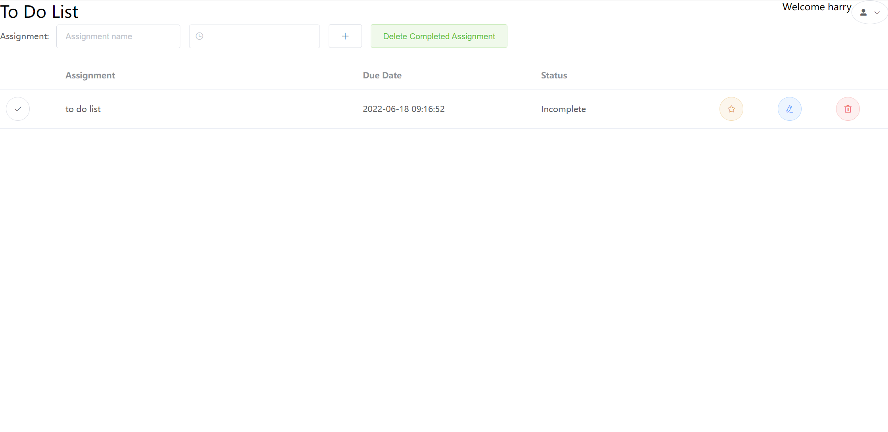

# To Do List Project
### Description
The project is a simple to do list web application. The data of the users and assignments are stored in a **mysql** database. The backend uses **Spring Boot** to manage different frameworks and the interactions between mapper, service and controller layers. It also uses **Mybatis-Plus** to simplify writing of sql code. The frontend uses **Vue** as its major framework since Vue's *Two-way Data Binding* simplifies data display. Moreover, components from **Element-UI** were used to improve styling. 
###Demo

